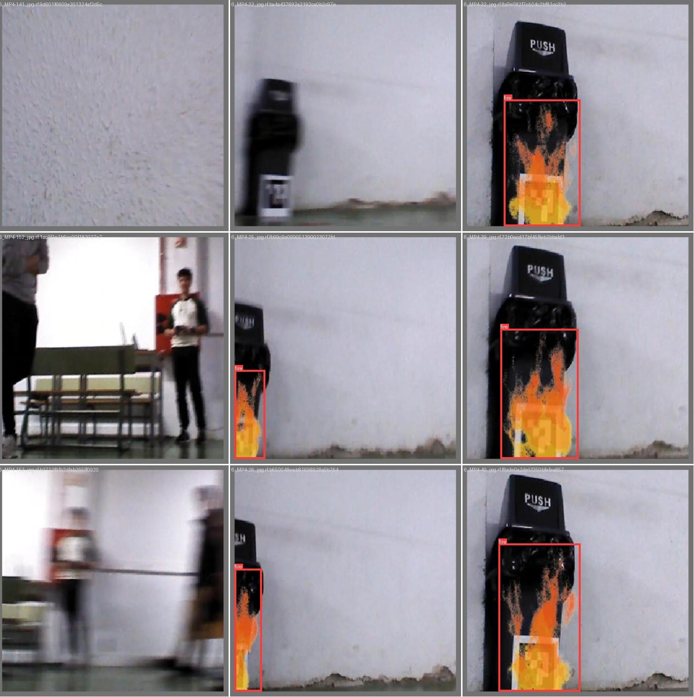

## Automated Fire Detection and Mapping Robotic System for Emergency Services Assistance:
#### Integration of SLAM-based Navigation, images/image Recognition, and Augmented Reality for Suitable Environmental Monitoring and Response
---
##### INTRODUCTION
An autonomous firefighter
robotic system assistance utilizing SLAM-based navigation, RGB-
D based CNN for fire detection, and fire-alert marker system.
The system seamlessly integrates real-time mapping, precise fire
detection and its localization on the map. It demonstrates a
promising solution for a prototype of firefighter robot.

##### TOOLS
+ **Hardware**: ROSbot 2R equipped with Rpi4 embedded computer, STM32F407 microcontroller, 4 encoders & DC motors for each wheel, IMU, RpLidar A2, Orbecc Astra RGB-D camera and 4 VL53L0X infrared distance sensor.

+ **Software**: 
    + Running under Husarion OS, provided by ROS middlewre.
    + Code implemented in C++ and Python. 
    + Rviz 3D visualizer, custom GUI server and gameped controller as HMI. 

+ **Integrated functionalities**: 
    + Localization via Adaptative Monte Carlo Localization (*AMCL*)
    + Simultaneous Localization And Mapping (SLAM) using *gmapping*
    + Autonomous navigation provided by *move_base*
    + Autonomous exploration powered by  *explore_lite*

##### CAPABILITIES

- **images/image recognition**:
Fire detection with model based on YOLOv8

- **Obstacle position estimation**:
Fire distance and angle estimation to the robot and map representation as a marker.

- **Descentralized computation**:
ROS connection between rosbot and server via LAN or P2P VPN network

- **GUI server**:
Website for monitoring and operation over all the Internet and with multi-plattform support.

##### FUNCTIONAL DIAGRAM

##### GETTING STARTED
Software development is divided into several ROS packages:
+ *descentralized_bringup*: Placeholder for programs launchfiles.
+ *cnn_image_processing*: Augmented reality via ArUco detection + fire recognition model + fire location estimation
+ *gamepad_controller*: Allow to control rosbot movement using a Xbox/PS4 controller device.
+ *map_marker*: fire marker placement on map
+ *robot_gui_bridge*: Graphical interface webserver
+ *ros_astra_camera*: Low level controller for camera activation
+ *rosbot_ekf*: Low level motors sensor and extended Kalman Filter for fusion sensor
+ *rplidar_ros*: Low level controller of LiDAR sensor
+ *tutorial_pkg*: Tutorial packages provided by manufacturer, modified for testing purposes.

Prerequisites: Ubuntu 20.04 or derivated flavours & ROS Noetic

Main functionality can be launched by executing next commands:
1. ``bash dependencies/setup.sh``
2. ``catkin_make``
3. ``roslaunch descentralized_bringup hardware.launch`` (ROSbot)
4. ``roslaunch descentralized_bringup software.launch`` (ROS slave device)

Sofware launcher has several arguments to select what to run:
| Argument | Description | Default value |
|---|---|---|
| localization | Map Server + AMCL (!) Not compatible with slam argument | True (&#9745;) |
| map_name | Yaml file loader for map Server.  | pasillo_patio.yaml |
| slam | Gmapping . (!) Not compatible with localization argument | False (&#x2612;) |
| CNN | YOLO Model + AR node  | True (&#9745;) |
| markers | Fire marker on map | True (&#9745;) |

##### PUBLISHED PAPER
More info about the project can be found on project_memory.pdf
